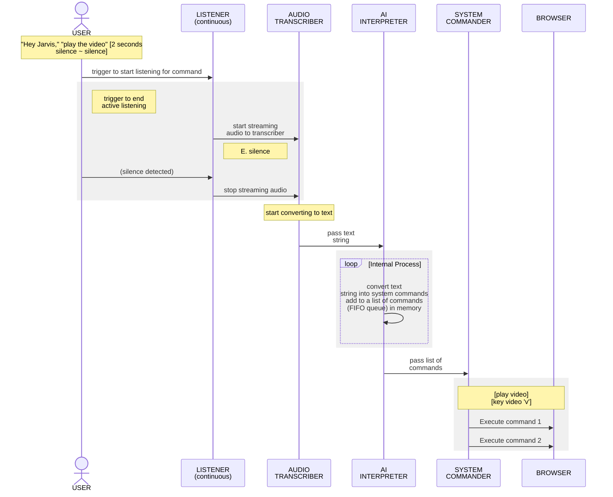

```mermaid

sequenceDiagram
    actor USER as USER
    participant LISTENER as LISTENER<br/>(continuous)
    participant TRANSCRIBER as AUDIO<br/>TRANSCRIBER
    participant INTERPRETER as AI<br/>INTERPRETER
    participant COMMANDER as SYSTEM<br/>COMMANDER
    participant BROWSER as BROWSER

    Note over USER: "Hey Jarvis," "play the video" [2 seconds<br/>silence ~ silence]

    USER->>LISTENER: trigger to start listening for command
    
    rect rgb(240, 240, 240)
        Note right of USER: trigger to end<br/>active listening
        
        LISTENER->>TRANSCRIBER: start streaming<br/>audio to transcriber
        Note right of LISTENER: E. silence
        
        USER->>LISTENER: (silence detected)
        LISTENER->>TRANSCRIBER: stop streaming audio
    end

    Note over TRANSCRIBER: start converting to text

    TRANSCRIBER->>INTERPRETER: pass text<br/>string

    rect rgb(240, 240, 240)
        loop Internal Process
            INTERPRETER->>INTERPRETER: convert text<br/>string into system commands<br/>add to a list of commands<br/>(FIFO queue) in memory
        end
    end

    INTERPRETER->>COMMANDER: pass list of<br/>commands

    rect rgb(240, 240, 240)
        Note over COMMANDER, BROWSER: [play video]<br/>[key video 'v']
        COMMANDER->>BROWSER: Execute command 1
        COMMANDER->>BROWSER: Execute command 2
    end

```
