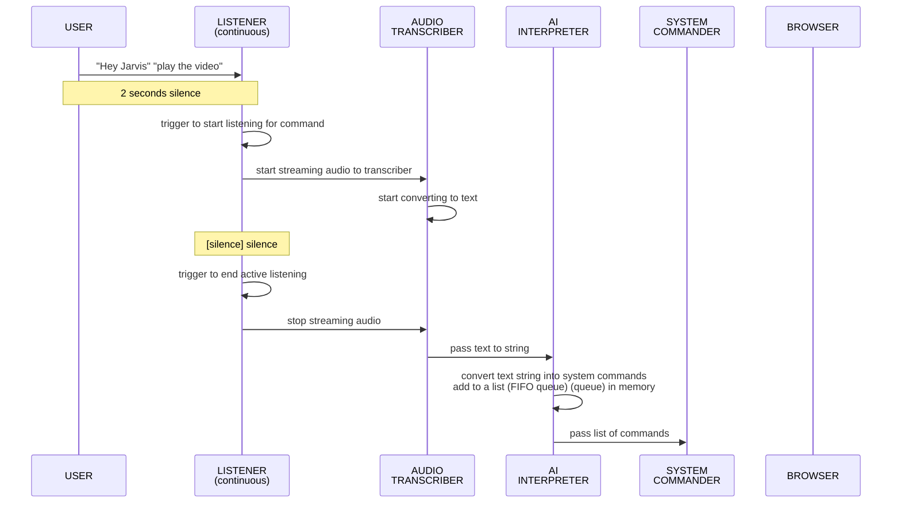

```mermaid

sequenceDiagram
    participant U as USER
    participant L as LISTENER<br/>(continuous)
    participant AT as AUDIO<br/>TRANSCRIBER
    participant AI as AI<br/>INTERPRETER
    participant SC as SYSTEM<br/>COMMANDER
    participant B as BROWSER

    U->>L: "Hey Jarvis" "play the video"
    Note over U,L: 2 seconds silence

    L->>L: trigger to start listening for command
    L->>AT: start streaming audio to transcriber
    AT->>AT: start converting to text

    Note over L: [silence] silence
    L->>L: trigger to end active listening
    L->>AT: stop streaming audio

    AT->>AI: pass text to string

    AI->>AI: convert text string into system commands<br/>add to a list (FIFO queue) (queue) in memory

    AI->>SC: pass list of commands
```

    SC->>B: [play video] [see video] "play"
