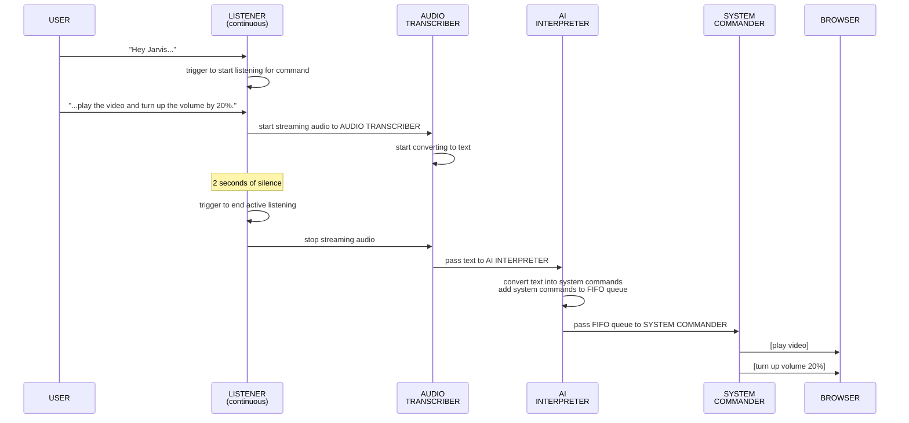

```mermaid

sequenceDiagram
    participant U as USER
    participant L as LISTENER<br/>(continuous)
    participant AT as AUDIO<br/>TRANSCRIBER
    participant AI as AI<br/>INTERPRETER
    participant SC as SYSTEM<br/>COMMANDER
    participant B as BROWSER

    U->>L: "Hey Jarvis..."

    L->>L: trigger to start listening for command

    U->>L: "...play the video and turn up the volume by 20%."

    L->>AT: start streaming audio to AUDIO TRANSCRIBER
    AT->>AT: start converting to text

    Note over L: 2 seconds of silence
    L->>L: trigger to end active listening
    L->>AT: stop streaming audio

    AT->>AI: pass text to AI INTERPRETER

    AI->>AI: convert text into system commands<br/>add system commands to FIFO queue

    AI->>SC: pass FIFO queue to SYSTEM COMMANDER

    SC->>B: [play video] 

    SC->>B: [turn up volume 20%] 

```
